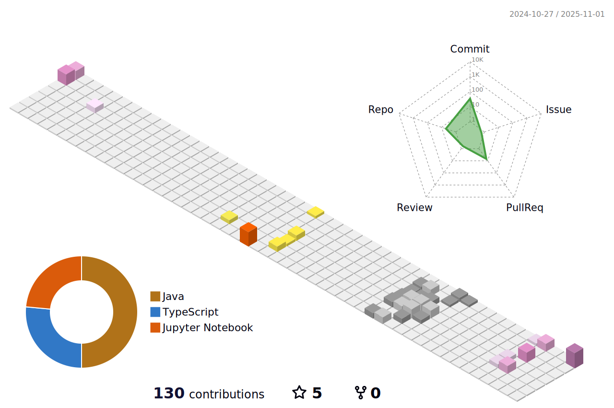

### Hi there 👋

# I'm a Full Stack Engineer

### Languages & Tools 🛠

### ℂ𝕠𝕟𝕥𝕣𝕚𝕓𝕦𝕥𝕚𝕠𝕟𝕤: 

### Analytics ⚙️

<!-- 

  

 -->

  

<!--  -->
### ⚔️ ℂ𝕠𝕕𝕖𝕎𝕒𝕣𝕤: 

### Contact Me 

  
  

