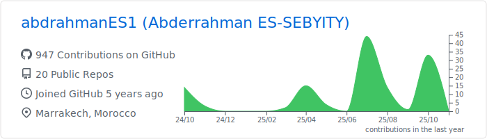

### Hi there 👋
##### I'm a Front-End Developer

<a href="https://github.com/abdrahmanES1">
### Languages & Tools 🛠

    
 
        
          
          
          
        
        
          
          
        
        
          
          
        
          
          

      

      ### Analytics ⚙️

    

      
    

    

      
    

    

    

      
      
    

</a>
